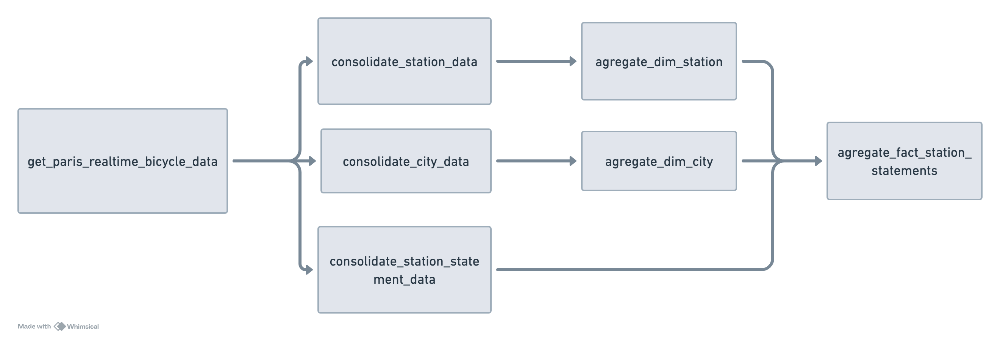
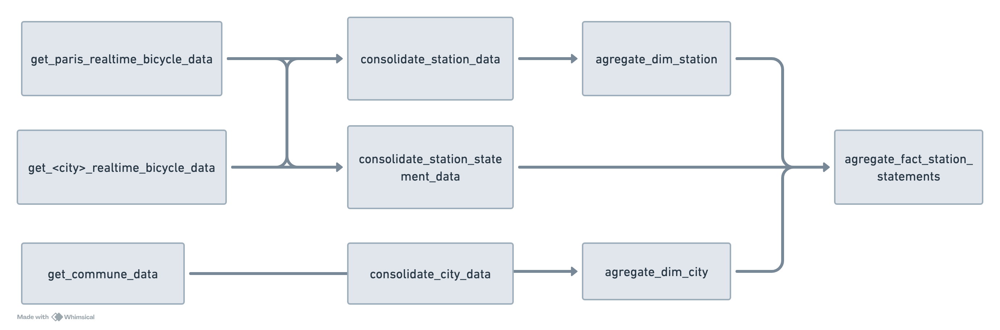

# Sujet de travaux pratiques "Introduction à la data ingénierie"

Le but de ce projet est de créer un pipeline ETL d'ingestion, de transformation et de stockage de données pour mettre en pratique les connaissances acquises lors du cours d'introduction à la data ingénierie. Ce sujet présenté propose d'utiliser les données d'utilisation des bornes de vélos open-sources et "temps réel" des bornes de vélos dans les grandes villes de France.

Le sujet propose une base qui est un pipeline ETL complet qui couvre la récupération, le stockage et la transformation des données open sources de la ville de Paris.

Le but du sujet de travaux pratiques est d'ajouter à ce pipeline des données provenant d'autres grandes villes de France. Ces données sont disponibles pour les villes de Nantes, de Toulouse ou encore de Strasbourg. Il faudra aussi enrichir ces données avec les données descriptives des villes de France, via une API de l'État français open-source.

## Explication du code existant

Le projet est découpé en 3 parties :

1. Un fichier python pour récupérer et stocker les données dans des fichiers localement

2. Un fichier python pour consolider les données et faire un premier load dans une base de données type data-warehouse

3. Un fichier python pour agréger les données et créer une modélisation de type dimensionnelle

### Ingestion des données

```python
def get_paris_realtime_bicycle_data():
    url = "https://opendata.paris.fr/api/explore/v2.1/catalog/datasets/velib-disponibilite-en-temps-reel/exports/json"
    response = requests.request("GET", url)
    serialize_data(response.text, "paris_realtime_bicycle_data.json")

def serialize_data(raw_json: str, file_name: str):
    today_date = datetime.now().strftime("%Y-%m-%d")
    if not os.path.exists(f"data/raw_data/{today_date}"):
        os.makedirs(f"data/raw_data/{today_date}")
    with open(f"data/raw_data/{today_date}/{file_name}", "w") as fd:
        fd.write(raw_json)
```

Ces fonctions python sont assez simples. Elles récupèrent les données sur une API open-source, et les stockent dans un fichier json localement. Ces fonctions sont dans le fichier python `data_ingestion.py`.

### Consolidation des données

**Duckdb** est une base de données de type data-warehouse que l'on peut utiliser localement, car elle charge les données en "in-memory" ou dans un fichier local. C'est l'équivalent de SQLite, mais pour des bases de données de type data-warehouse. Créer une connexion duckdb permet de "créer" une database et d'interagir avec comme avec un vrai data-warehouse. C'est parfait pour des projets de ce type. Plus d'informations sur le site officiel de duckdb : https://duckdb.org/.

Dans le fichier `data_consolidation.py` on trouve une fonction qui permet de créer les tables dans une base de données **duckdb**. On utilise le fichier `create_consolidate_tables.sql` pour définir les schémas des tables. Vous ne devriez pas avoir à modifier les schémas des tables, mais vous pouvez le faire si vous voyez une optimisation ou si le schéma est contraignant pour vous pour la réalisation de ce TP.

```python
def create_consolidate_tables():
    con = duckdb.connect(database = "data/duckdb/mobility_analysis.duckdb", read_only = False)
    with open("data/sql_statements/create_consolidate_tables.sql") as fd:
        statements = fd.read()
    for statement in statements.split(";"):
        print(statement)
        con.execute(statement)
```

Une fois les tables créées, on peut lancer les autres fonctions de consolidation. Elles fonctionnent toutes de la même manière :

```python
def consolidate_station_data():
    con = duckdb.connect(database = "data/duckdb/mobility_analysis.duckdb", read_only = False)
    data = {}
    # Consolidation logic for Paris Bicycle data
    with open(f"data/raw_data/{today_date}/paris_realtime_bicycle_data.json") as fd:
        data = json.load(fd)
    paris_raw_data_df = pd.json_normalize(data)
    paris_raw_data_df["id"] = paris_raw_data_df["stationcode"].apply(lambda x: f"{PARIS_CITY_CODE}-{x}")
    paris_raw_data_df["address"] = None
    paris_raw_data_df["created_date"] = date.today()
    paris_station_data_df = paris_raw_data_df[[
        "id",
        "stationcode",
        "name",
        "nom_arrondissement_communes",
        "code_insee_commune",
        "address",
        "coordonnees_geo.lon",
        "coordonnees_geo.lat",
        "is_installed",
        "created_date",
        "capacity"
    ]]
    paris_station_data_df.rename(columns={
        "stationcode": "code",
        "name": "name",
        "coordonnees_geo.lon": "longitude",
        "coordonnees_geo.lat": "latitude",
        "is_installed": "status",
        "nom_arrondissement_communes": "city_name",
        "code_insee_commune": "city_code"
    }, inplace=True)
    con.execute("INSERT OR REPLACE INTO CONSOLIDATE_STATION SELECT * FROM paris_station_data_df;")
```

Explication de cette fonction :

- On commence par créer une connexion à la base duckdb (`read_only = False`) car on va insérer les données dans la base.

- On charge les données depuis les fichiers JSON locaux que l'on a ingérés dans l'étape précédente dans un dataframe Pandas.

- On travaille notre dataframe pour :
  - renommer les colonnes
  - supprimer les colonnes inutiles
  - ajouter des colonnes qui sont attendues par la table `CONSOLIDATE_STATION` dans notre base de données (ici `id`, `address`, `created_date`)

- On insère les données dans la base directement depuis le dataframe (fonctionnalité de duckdb, voir la documentation).

**ATTENTION** : Lors de l'insertion de données dans une table duckdb avec une requête SQL `INSERT OR REPLACE INTO CONSOLIDATE_STATION SELECT * FROM paris_station_data_df;`, il faut s'assurer que :

- votre dataframe contient le même nombre de colonnes que la table dans la base de données
- les colonnes dans votre dataframe et dans la table doivent être dans le même ordre

**ATTENTION 2** : Les données sont historisées dans les tables de consolidation (d'où la présence des colonnes `created_date` et `id` ou `station_id`). C'est uniquement un choix de conception. Vous pouvez changer ce comportement et supprimer / recharger les données à chaque fois.

Les autres fonctions de consolidation sont similaires.

### Agrégation des données

Dans le fichier `data_agregation.py` on trouve une fonction qui permet de créer les tables dans une base de données **duckdb**. On utilise le fichier `create_agregate_tables.sql` pour définir les schémas des tables. Ces tables représentent une modélisation dimensionnelle simple :

- Deux tables de dimensions : `dim_city` et `dim_station` qui représentent les données descriptives des villes et des stations de vélos en libre-service.

- Une table de faits : `fact_station_statement` qui représente les relevés de disponibilité des vélos dans les stations.

Vous ne devriez pas avoir à modifier les schémas des tables, mais vous pouvez le faire si vous voyez une optimisation ou si le schéma est contraignant pour vous pour la réalisation de ce TP.

```python
def create_agregate_tables():
    con = duckdb.connect(database = "data/duckdb/mobility_analysis.duckdb", read_only = False)
    with open("data/sql_statements/create_agregate_tables.sql") as fd:
        statements = fd.read()
    for statement in statements.split(";"):
        print(statement)
        con.execute(statement)
```

Une fois les tables créées, on peut lancer les autres fonctions d'agrégation. Pour les tables de dimensions, les fonctions sont assez simples. Elles basculent les données des tables de consolidation dans leur table correspondante.

La fonction pour la table `fact_station_statement` est plus complexe. Car elle doit faire les jointures avec les autres tables pour que les données soient analysables avec les données descriptives des tables de dimensions. C'est pourquoi elle est remplie via cette requête SQL :

```sql
INSERT OR REPLACE INTO FACT_STATION_STATEMENT
SELECT STATION_ID, CITY_CODE, BICYCLE_DOCKS_AVAILABLE, BICYCLE_AVAILABLE, LAST_STATEMENT_DATE, current_date as CREATED_DATE
FROM CONSOLIDATE_STATION_STATEMENT
JOIN CONSOLIDATE_STATION ON CONSOLIDATE_STATION.ID = CONSOLIDATE_STATION_STATEMENT.STATION_ID
LEFT JOIN CONSOLIDATE_CITY as cc ON cc.ID = CONSOLIDATE_STATION.CITY_CODE
WHERE CONSOLIDATE_STATION_STATEMENT.CREATED_DATE = (SELECT MAX(CREATED_DATE) FROM CONSOLIDATE_STATION_STATEMENT)
AND CONSOLIDATE_STATION.CREATED_DATE = (SELECT MAX(CREATED_DATE) FROM CONSOLIDATE_STATION);
```

Cette requête SQL réalise une jointure entre la table `CONSOLIDATE_STATION` et la table `CONSOLIDATE_STATION_STATEMENT`. Ensuite, elle fait une jointure avec la table `CONSOLIDATE_CITY`, pour obtenir l'ID de la ville. Enfin, elle remplit la table `FACT_STATION_STATEMENT` avec les données récupérées. On ne récupère que les dernières données des tables de consolidation via les deux `CONSOLIDATE_STATION_STATEMENT.CREATED_DATE = (SELECT MAX(CREATED_DATE) FROM...)` car on a décidé d'historiser les données de nos tables de consolidation.

### Le fichier main.py

Le fichier `main.py` contient le code principal du processus et exécute séquentiellement les différentes fonctions expliquées plus haut. L'ordre des fonctions de consolidation et d'agrégation n'est pas important.

### En résumé

Voici un aperçu du processus final :



Même si les différents jobs sont présentés parallèlement ici, ils sont en vérité exécutés séquentiellement (voir le fichier `main.py`) car :

- On ne peut pas faire de l'orchestration facilement dans les environnements locaux de Polytech

- Ce n'est pas possible d'avoir des connexions concurrentes sur un cluster Duckdb en lecture / écriture.

Cependant, ce pipeline ETL permet in fine de réaliser des analyses simples :

## Sujet du TP

Le but de ce TP est d'enrichir ce pipeline avec des données provenant d'autres villes. Les sources de données disponibles sont :

- [Open data Nantes](https://data.nantesmetropole.fr/explore/dataset/244400404_stations-velos-libre-service-nantes-metropole-disponibilites/api/)

- [Open data Toulouse](https://data.toulouse-metropole.fr/explore/dataset/api-velo-toulouse-temps-reel/api/)

**L'ajout d'une seule source de données est suffisant.**

Aussi, il faut remplacer la source de données des tables `CONSOLIDATE_CITY` et `DIM_CITY` par les données provenant de l'API suivante :

- [Open data communes](https://geo.api.gouv.fr/communes)

Une fois l'acquisition de ces nouvelles données réalisée, il faut enrichir le pipeline avec les étapes suivantes :

- ajouter les données de la nouvelle ville dans la consolidation des tables `CONSOLIDATE_STATION` et `CONSOLIDATE_STATION_STATEMENT`

- remplacer la consolidation de `CONSOLIDATE_CITY` et l'adapter pour utiliser les données des communes récupérées plus haut

- adapter si besoin les processus d'agrégation des tables `DIM_STATION` et `FACT_STATION_STATEMENT` et `DIM_CITY`

Au final, le pipeline ETL manager devrait ressembler à ce qui suit :



Au final, vous devriez être capable de réaliser les requêtes SQL suivantes sur votre base de données DuckDB :

```sql
-- Nb d'emplacements disponibles de vélos dans une ville
SELECT dm.NAME, tmp.SUM_BICYCLE_DOCKS_AVAILABLE
FROM DIM_CITY dm INNER JOIN (
    SELECT CITY_ID, SUM(BICYCLE_DOCKS_AVAILABLE) AS SUM_BICYCLE_DOCKS_AVAILABLE
    FROM FACT_STATION_STATEMENT
    WHERE CREATED_DATE = (SELECT MAX(CREATED_DATE) FROM CONSOLIDATE_STATION)
    GROUP BY CITY_ID
) tmp ON dm.ID = tmp.CITY_ID
WHERE lower(dm.NAME) in ('paris', 'nantes', 'vincennes', 'toulouse');

-- Nb de vélos disponibles en moyenne dans chaque station
SELECT ds.name, ds.code, ds.address, tmp.avg_dock_available
FROM DIM_STATION ds JOIN (
    SELECT station_id, AVG(BICYCLE_AVAILABLE) AS avg_dock_available
    FROM FACT_STATION_STATEMENT
    GROUP BY station_id
) AS tmp ON ds.id = tmp.station_id;
```

### Barème utilisé pour la notation finale :

- Les ingestions fonctionnent correctement et produisent des fichiers json localement (5 points)

- La consolidation actuelle est correctement enrichie avec les nouvelles données (5 points)

- L'agrégation des données est correctement réalisée et les requêtes SQL ci-dessus fonctionnent correctement (5 points)

- Le projet est correctement documenté (installation, exécution, explication de la logique du pipeline) (5 points)

- 2 points bonus pour la clarté générale du code (commentaires, noms de variables, etc.)

- 2 points bonus si d'autres sources de données sont ajoutées pour enrichir l'analyse finale. Attention, le projet doit fonctionner correctement.
